<h2 align="center">
    <a href="https://dainam.edu.vn/vi/khoa-cong-nghe-thong-tin">
    🎓 Faculty of Information Technology (DaiNam University)
    </a>
</h2>
<h2 align="center">
   HỆ THỐNG QUẢN LÝ THƯ VIỆN TRỰC TUYẾN
</h2>

<div align="center">
    <p align="center">
        
        
        
    </p>

[](https://www.facebook.com/DNUAIoTLab)
[](https://dainam.edu.vn/vi/khoa-cong-nghe-thong-tin)
[](https://dainam.edu.vn)

</div>

---

## 1. 📖 Giới thiệu Đề tài

**Hệ thống Quản lý Thư viện Trực tuyến** là đồ án môn **Lập trình Mạng**, được phát triển bằng Java với kiến trúc TCP Client-Server. Hệ thống sử dụng MongoDB làm cơ sở dữ liệu và giao diện Java Swing hiện đại với FlatLaf, hỗ trợ quản lý sách, người dùng, mượn/trả sách, thống kê báo cáo một cách toàn diện.

### ⚡ Tính năng nổi bật:

- **🏗️ Kiến trúc TCP Client-Server** - Ứng dụng hỗ trợ đa client kết nối đồng thời qua TCP
- **🗄️ MongoDB Integration** - Lưu trữ dữ liệu với 6 collections chính
- **🔐 Bảo mật nâng cao** - Mã hóa mật khẩu BCrypt, quản lý session đơn
- **📚 Quản lý toàn diện** - CRUD đầy đủ cho sách, người dùng, mượn/trả
- **🖥️ Giao diện hiện đại** - Java Swing với FlatLaf Look & Feel
- **📊 Báo cáo chi tiết** - Thống kê theo khoa, trạng thái, thời gian
- **🔍 Tìm kiếm thông minh** - Multi-criteria search với filters
- **👥 Phân quyền rõ ràng** - Admin và User với chức năng riêng biệt

### 🔑 Tài khoản mặc định:
- **Admin**: `dainam@dnu.edu.vn` / `dainam`
- **User**: `nghia@dnu.edu.vn` / `nghia123`

---

## 2. 🛠️ Công nghệ sử dụng

| Công nghệ                      | Phiên bản    | Mục đích sử dụng                          |
|--------------------------------|--------------|-------------------------------------------|
| **Java**                       | 17 LTS       | Ngôn ngữ lập trình chính                  |
| **Java Swing**                 | Built-in     | Xây dựng giao diện người dùng             |
| **MongoDB**                    | 4.11.1       | Cơ sở dữ liệu NoSQL lưu trữ dữ liệu       |
| **Maven**                      | Latest       | Quản lý dependencies và build project     |
| **FlatLaf**                    | 3.2.5        | Modern Look & Feel cho Java Swing        |
| **Jackson**                    | 2.15.2       | Xử lý JSON serialization/deserialization |
| **BCrypt**                     | 0.4          | Mã hóa mật khẩu an toàn                  |
| **Logback**                    | 1.4.11       | Hệ thống logging chi tiết                |

### 🗂️ Cấu trúc Database (MongoDB Collections):
- **`books`** - Thông tin sách (title, author, ISBN, category...)
- **`book_copies`** - Bản copy của sách (trạng thái, vị trí...)
- **`users`** - Tài khoản người dùng (admin/user, thông tin cá nhân)
- **`borrow_records`** - Lịch sử mượn/trả sách
- **`fines`** - Quản lý phạt (quá hạn, mất sách...)
- **`categories`** - Danh mục thể loại sách

---

## 3. 📸 Hình ảnh Demo

> **Lưu ý**: Tất cả ảnh demo được lưu trữ tại thư mục `docs/projects/anhduan/`

---

## 👑 CHỨC NĂNG ADMIN

### 🔐 Đăng nhập Admin

<div align="center">
  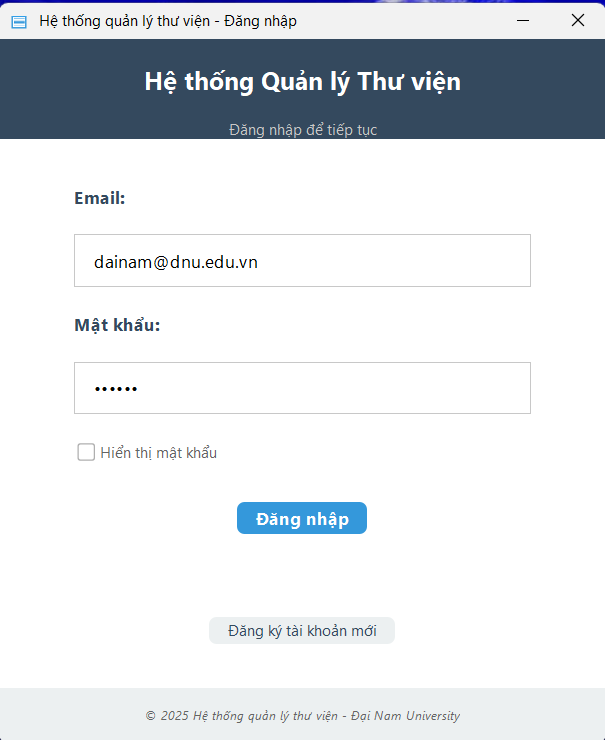
  <p><em>Giao diện đăng nhập Admin với validation và modern UI</em></p>
</div>

### 📊 Dashboard Admin

<div align="center">
  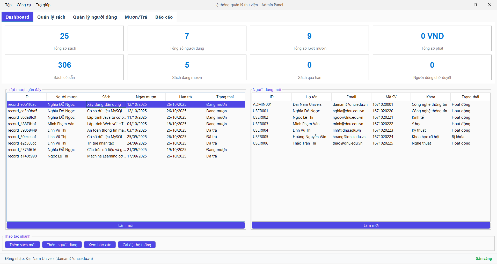
  <p><em>Dashboard Admin với thống kê tổng quan, biểu đồ và các chỉ số quan trọng</em></p>
</div>

### 📚 Quản lý Sách (Admin)

<div align="center">
  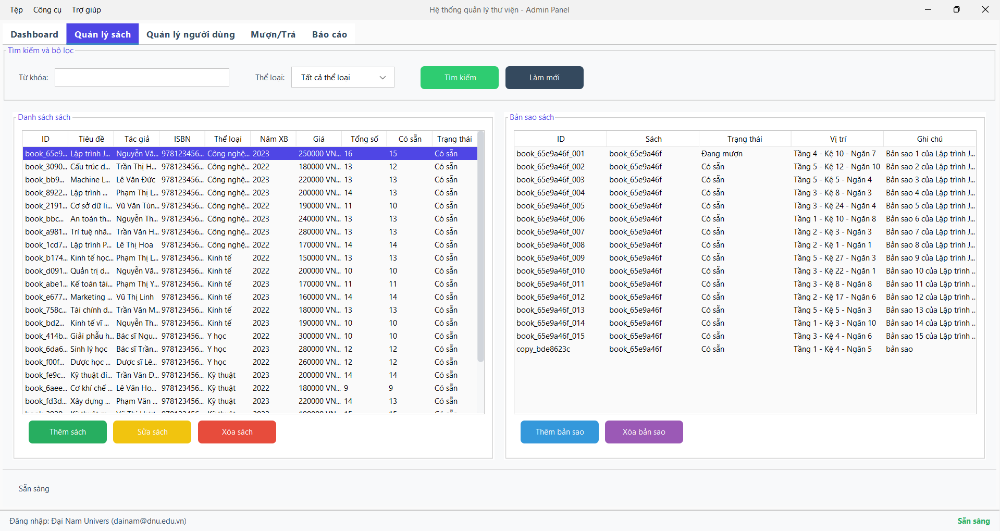
  <p><em>Quản lý sách với quyền Admin: thêm, sửa, xóa sách và các thao tác CRUD đầy đủ</em></p>
</div>

### 👥 Quản lý Người dùng (Admin)

<div align="center">
  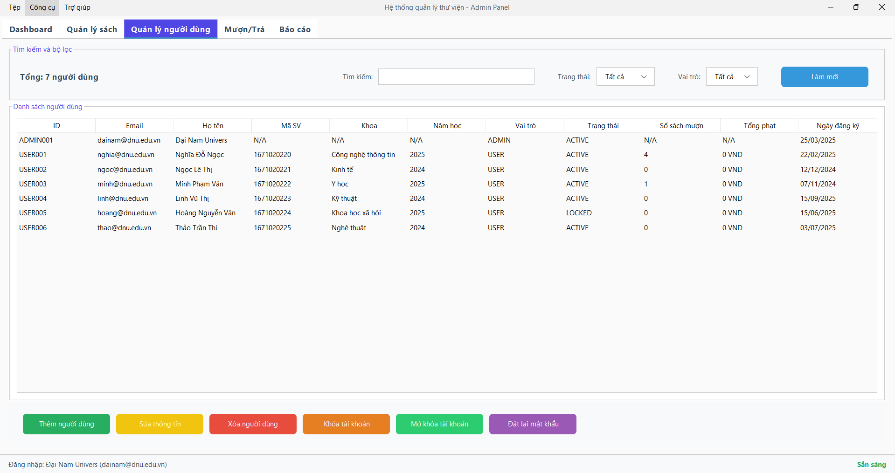
  <p><em>Quản lý người dùng: Admin hiển thị đầu tiên, phân quyền và quản lý tài khoản</em></p>
</div>

<div align="center">
  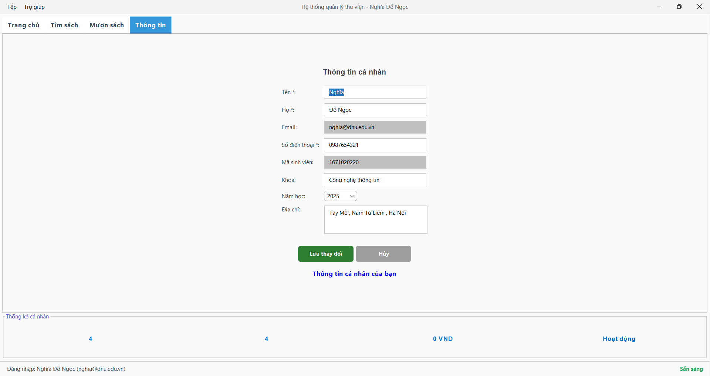
  <p><em>Chi tiết thông tin người dùng với khả năng chỉnh sửa và cập nhật</em></p>
</div>

### 📖 Quản lý Mượn/Trả (Admin)

<div align="center">
  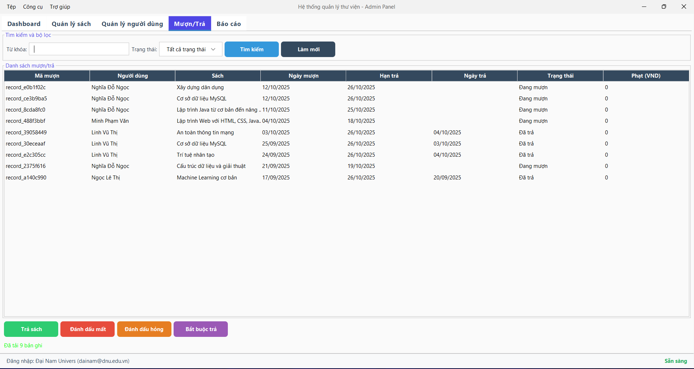
  <p><em>Quản lý mượn/trả sách toàn hệ thống với tracking trạng thái chi tiết</em></p>
</div>

### 📈 Báo cáo và Thống kê (Admin)

<div align="center">
  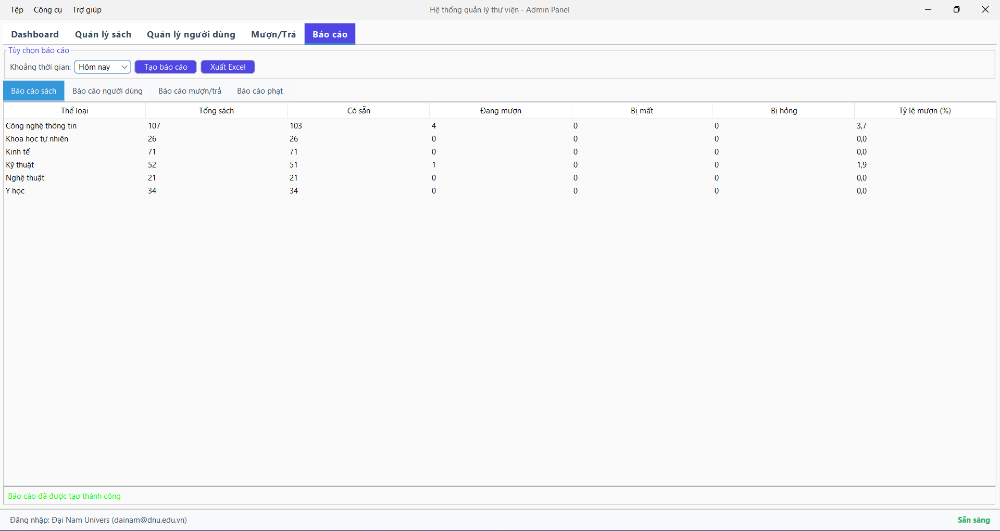
  <p><em>Hệ thống báo cáo với biểu đồ, thống kê theo khoa và export dữ liệu</em></p>
</div>

---

## 👤 CHỨC NĂNG USER

### 🔐 Đăng nhập User

<div align="center">
  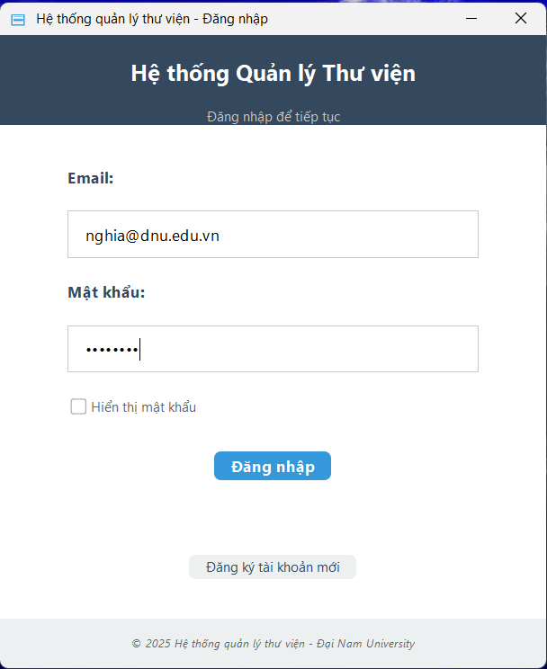
  <p><em>Giao diện đăng nhập User với theme tối và link đăng ký tài khoản mới</em></p>
</div>

### 🏠 Trang chủ User

<div align="center">
  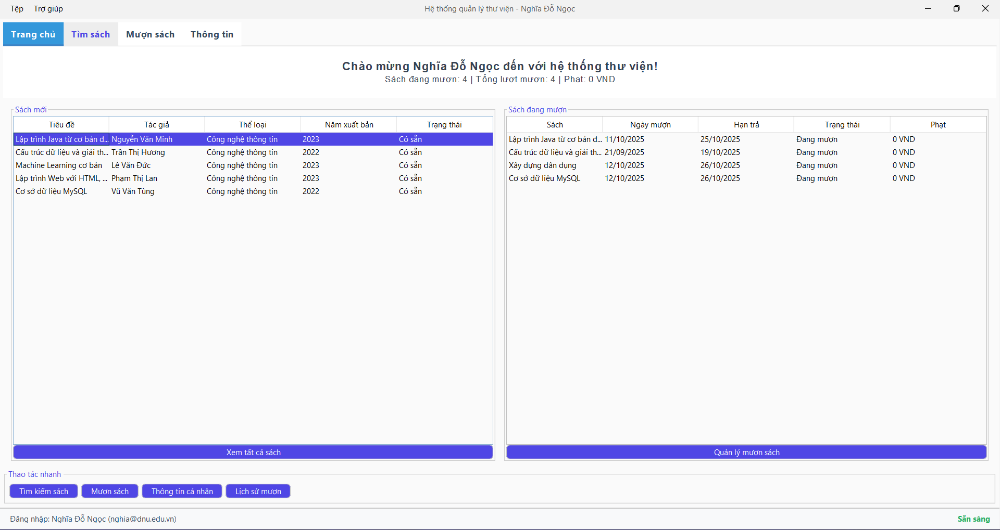
  <p><em>Trang chủ User với giao diện thân thiện, hiển thị sách mới và thông tin cá nhân</em></p>
</div>

### 🔍 Tìm kiếm Sách (User)

<div align="center">
  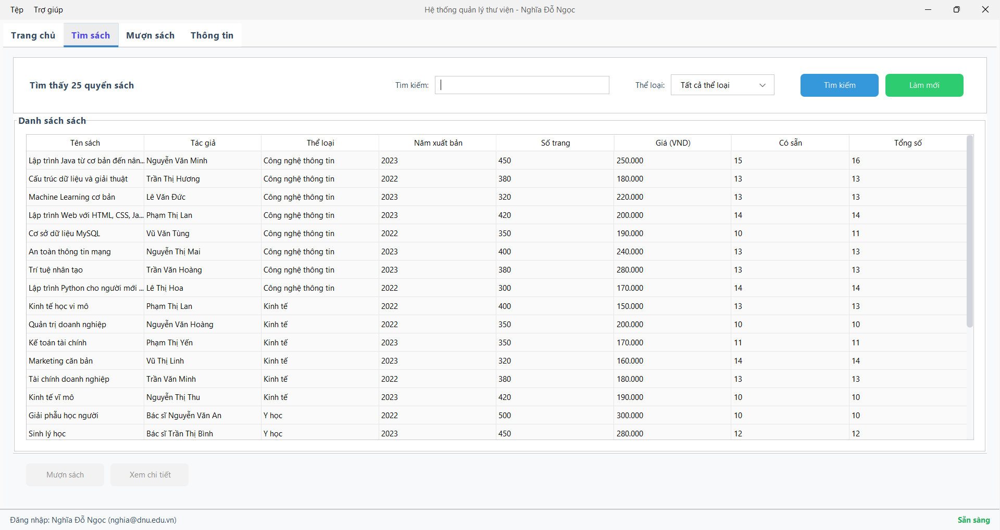
  <p><em>Chức năng tìm kiếm sách với filter đa tiêu chí và xem thông tin chi tiết</em></p>
</div>

### 📖 Mượn Sách (User)

<div align="center">
  
  <p><em>Giao diện mượn sách với kiểm tra tồn kho và validation nghiệp vụ</em></p>
</div>

### 📝 Đăng ký Tài khoản

<div align="center">
  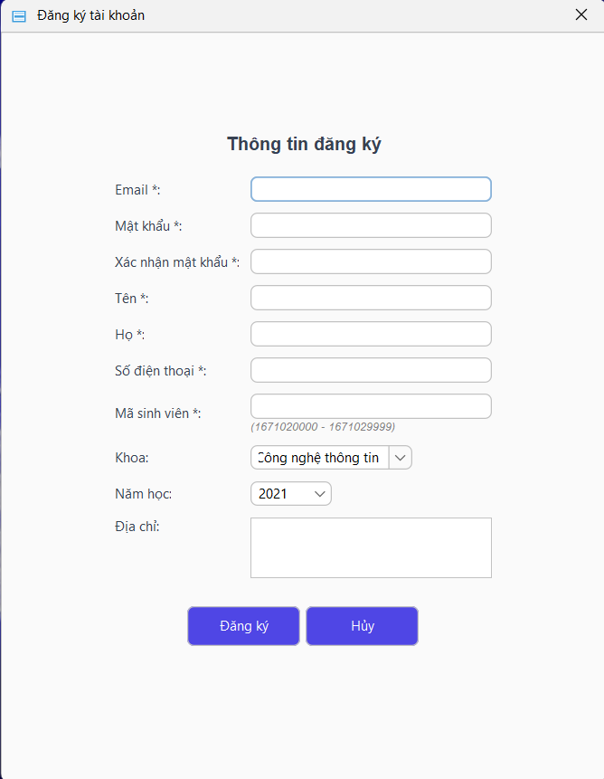
  <p><em>Form đăng ký tài khoản mới với validation đầy đủ cho sinh viên</em></p>
</div>

---

## 🗄️ HỆ THỐNG DATABASE

### 📊 Dữ liệu MongoDB

<div align="center">
  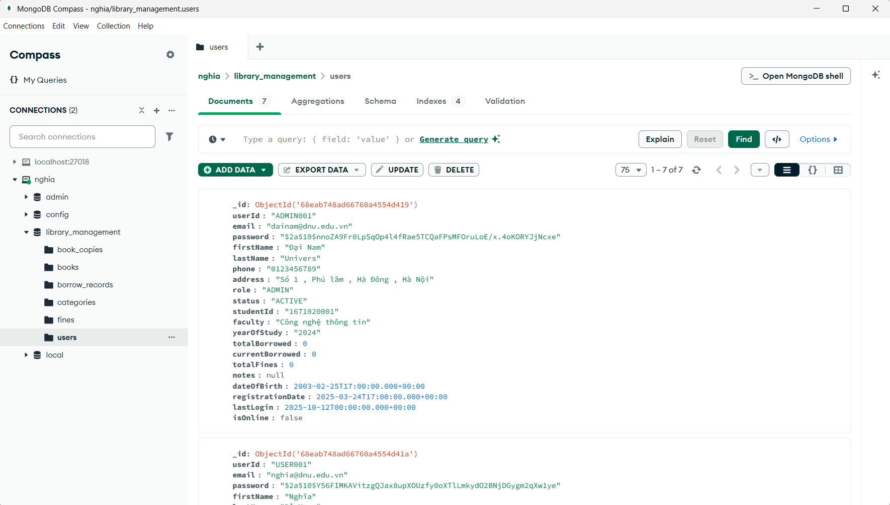
  <p><em>Cấu trúc database MongoDB với 6 collections và dữ liệu mẫu phong phú</em></p>
</div>

---

## 4. ⚙️ Cài đặt và Chạy

### 📋 Yêu cầu hệ thống
- **Java 17** trở lên (OpenJDK hoặc Oracle JDK)
- **MongoDB Community Server** 6.0+ chạy trên `localhost:27017`
- **Maven 3.8+** để build project
- **Windows 10/11** (đã test và tối ưu)
- **RAM**: khuyến nghị 8GB
- **Dung lượng**: ~100MB cho ứng dụng và dependencies

### 🚀 Hướng dẫn cài đặt và chạy 

**Bước 1: Chuẩn bị môi trường**
```powershell
# Kiểm tra Java version
java -version

# Kiểm tra Maven
mvn -version

# Kiểm tra MongoDB đang chạy
mongosh --eval "db.adminCommand('hello')"
```

**Bước 2: Clone và cài đặt project**
```powershell
# Di chuyển đến thư mục dự án
cd d:\BTL_LTM

# Clean và cài đặt dependencies
mvn clean install

# Copy dependencies để chạy standalone
mvn dependency:copy-dependencies -DoutputDirectory=target/lib
```

**Bước 3: Khởi tạo database và dữ liệu mẫu**
```powershell
# Chạy ứng dụng lần đầu sẽ tự động tạo database và sample data
mvn compile exec:java -Dexec.mainClass=com.dainam.library.LibraryManagementSystem
```

**Bước 4: Chạy ứng dụng bằng script**
```powershell
# Windows: Sử dụng batch files có sẵn
.\start-server.bat    # Client thứ nhất
.\start-client.bat    # Client thứ hai (để test single-session)

# Hoặc chạy trực tiếp bằng Maven
mvn compile exec:java -Dexec.mainClass=com.dainam.library.LibraryManagementSystem
```

### 🔑 Tài khoản đăng nhập

| Loại tài khoản | Email | Mật khẩu | Mô tả |
|----------------|-------|----------|-------|
| **Admin** | `dainam@dnu.edu.vn` | `dainam` | Quản trị viên toàn quyền |
| **User** | `nghia@dnu.edu.vn` | `nghia123` | Sinh viên CNTT |
| **User** | `ngoc@dnu.edu.vn` | `ngoc123` | Sinh viên Kinh tế |


## 5. 👨‍💻 Thông tin Phát triển

| Trường thông tin         | Nội dung                                 |
|-------------------------|-------------------------------------------|
| **🏛️ Trường**           | Đại học Đại Nam (DaiNam University)      |
| **💻 Khoa**              | Công nghệ Thông tin                      |
| **📚 Môn học**           | Lập trình Mạng                           |
| **👤 Sinh viên**         | Đỗ Ngọc Nghĩa                            |
| **📧 Email**             | dnghia9119@gmail.com                     |
| **🌐 Website cá nhân**     | [dnnghia.vercel.app](https://dnnghia.vercel.app/)             |
| **Lớp**                 | CNTT 16-03                               |
| **Năm học**             | 2025-2026                                |

---

<div align="center">
    <p><strong>© 2025 DaiNam University - Faculty of Information Technology</strong></p>
    <p>All rights reserved.</p>
</div>
