<h2 align="center">
    <a href="https://dainam.edu.vn/vi/khoa-cong-nghe-thong-tin">
    🎓 Faculty of Information Technology (DaiNam University)
    </a>
</h2>
<h2 align="center">
   HỆ THỐNG QUẢN LÝ SÁCH - THƯ VIỆN QUA MẠNG
</h2>

<div align="center">
    <p align="center">
        
        
        
    </p>

[](https://www.facebook.com/DNUAIoTLab)
[](https://dainam.edu.vn/vi/khoa-cong-nghe-thong-tin)
[](https://dainam.edu.vn)

</div>

---

## 1. 📖 Giới thiệu Đề tài

**Hệ thống Quản lý Sách Thư viện qua Mạng** là đồ án môn **Lập trình Mạng**, xây dựng bằng Java với kiến trúc Client-Server sử dụng giao thức TCP, kết nối cơ sở dữ liệu MongoDB. Hệ thống cho phép quản lý sách, mượn/trả sách, thống kê, tìm kiếm, và các chức năng quản lý thư viện hiện đại. Giao diện được thiết kế bằng Java Swing hiện đại, dễ sử dụng, bố cục hợp lý, hỗ trợ nhiều người dùng đồng thời.

### ⚡ Yêu cầu & Đặc điểm nổi bật:

- **🌐 Kết nối client-server** qua TCP socket, xử lý đa luồng
- **🗄️ Quản lý dữ liệu** sách, người dùng, mượn/trả qua MongoDB  
- **📚 Đầy đủ chức năng** CRUD (thêm, sửa, xóa), mượn/trả, thống kê, tìm kiếm
- **🖥️ Giao diện Java Swing** hiện đại, dễ sử dụng
- **🔐 Tài khoản mặc định**: 
  - Email: `dainam@gmail.com`
  - Mật khẩu: `dainam`
- **⚙️ Đảm bảo** logic nghiệp vụ, đồng bộ dữ liệu, bảo mật cơ bản

---

## 2. 🛠️ Công nghệ sử dụng

| Công nghệ                      | Mục đích sử dụng                        |
|--------------------------------|-----------------------------------------|
| **Java 17**                    | Ngôn ngữ lập trình chính                |
| **Java Swing**                 | Xây dựng giao diện người dùng           |
| **TCP Socket**                 | Giao tiếp Client-Server                 |
| **MongoDB**                    | Lưu trữ dữ liệu sách, người dùng, mượn trả |
| **Maven**                      | Quản lý thư viện/phụ thuộc              |
| **FlatLaf**                    | Giao diện Swing hiện đại                |
| **Jackson**                    | Xử lý JSON                              |
| **BCrypt**                     | Mã hóa mật khẩu người dùng              |
| **Đa luồng (ExecutorService)** | Xử lý nhiều client đồng thời            |

---

## 3. 📸 Hình ảnh Demo

> **Lưu ý**: Tất cả ảnh demo được lưu trữ tại thư mục `docs/projects/anhduan/`

### 🔐 Giao diện đăng nhập

<div align="center">
  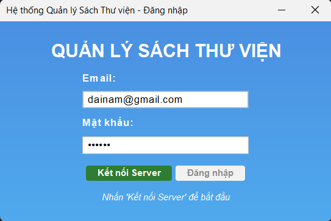
  <p><em>Màn hình đăng nhập với tài khoản mặc định: dainam@gmail.com</em></p>
</div>

---

### 🌐 Kết nối Server-Client

<div align="center">
  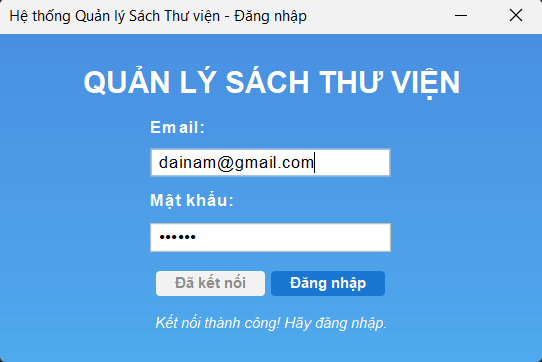
  <p><em>Thông báo kết nối thành công với Library Management Server qua TCP socket</em></p>
</div>

---

### 🏠 Giao diện chính của hệ thống

<div align="center">
  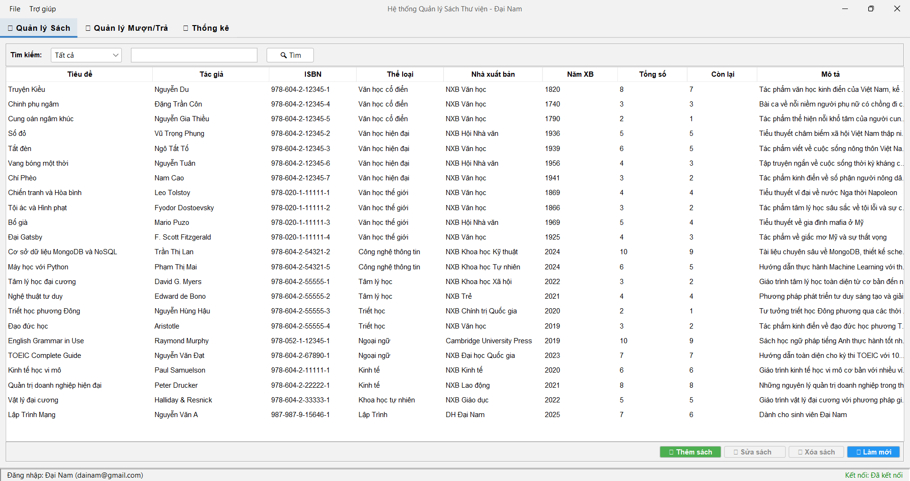
  <p><em>Dashboard quản lý sách với danh sách hiển thị dạng bảng, thanh tìm kiếm và các nút chức năng</em></p>
</div>

---

### 📚 Các chức năng quản lý sách

#### ➕ **Thêm sách mới**
<div align="center">
  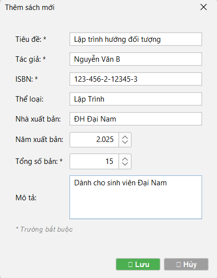
  <p><em>Dialog thêm sách với form validation và các trường thông tin đầy đủ</em></p>
</div>

#### ✏️ **Cập nhật thông tin sách**
<div align="center">
  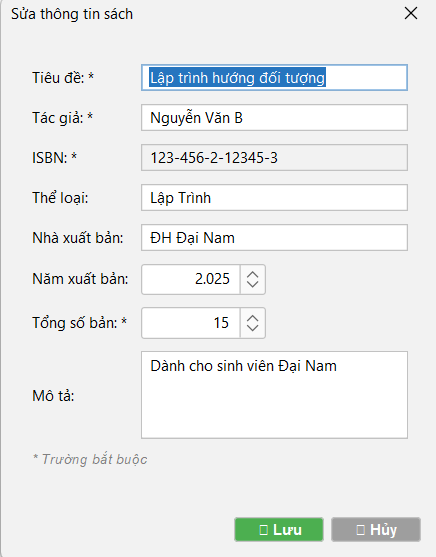
  <p><em>Chức năng sửa sách với form được điền trước thông tin hiện tại</em></p>
</div>

#### 🗑️ **Xóa sách khỏi hệ thống**
<div align="center">
  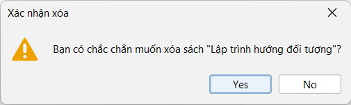
  <p><em>Dialog xác nhận xóa sách với thông tin chi tiết để đảm bảo an toàn</em></p>
</div>

#### 🔍 **Tìm kiếm sách thông minh**
<div align="center">
  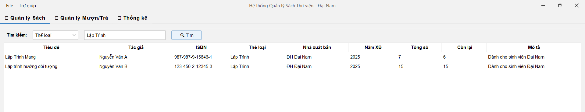
  <p><em>Tìm kiếm theo nhiều tiêu chí: tên sách, tác giả, thể loại</em></p>
</div>

---

### 📖 Quản lý mượn/trả sách

#### **Giao diện mượn sách**
<div align="center">
  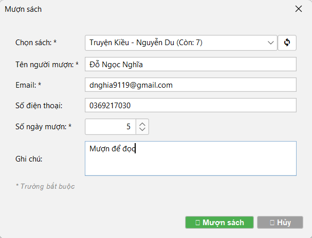
  <p><em>Form mượn sách với thông tin người mượn và validation số lượng có sẵn</em></p>
</div>

#### **Danh sách giao dịch mượn/trả**
<div align="center">
  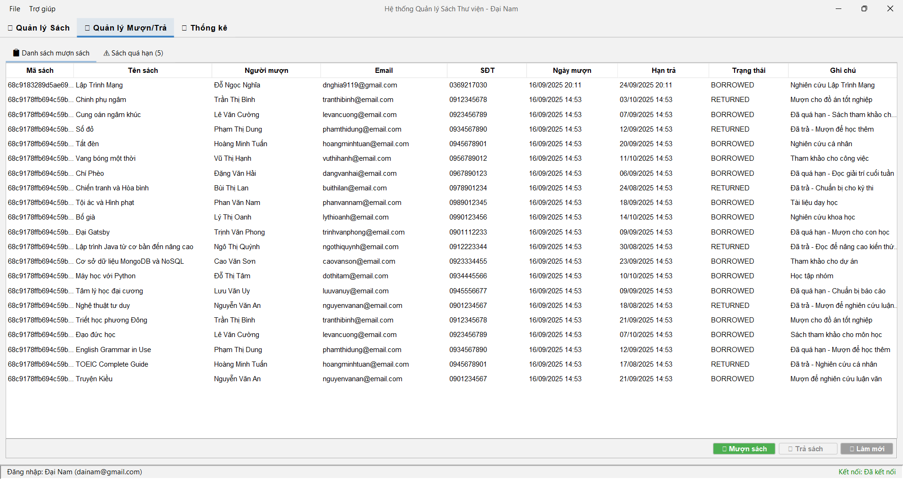
  <p><em>Bảng hiển thị tất cả giao dịch mượn/trả với trạng thái chi tiết</em></p>
</div>

#### **Quản lý sách quá hạn**
<div align="center">
  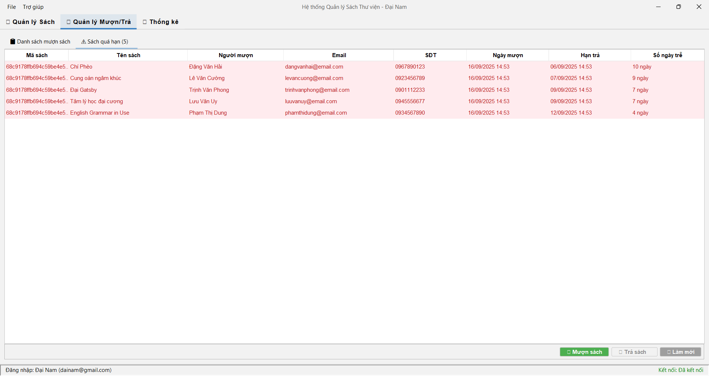
  <p><em>Danh sách sách quá hạn với highlight màu đỏ và tính năng nhắc nhở</em></p>
</div>

---

### 📊 Thống kê và báo cáo

<div align="center">
  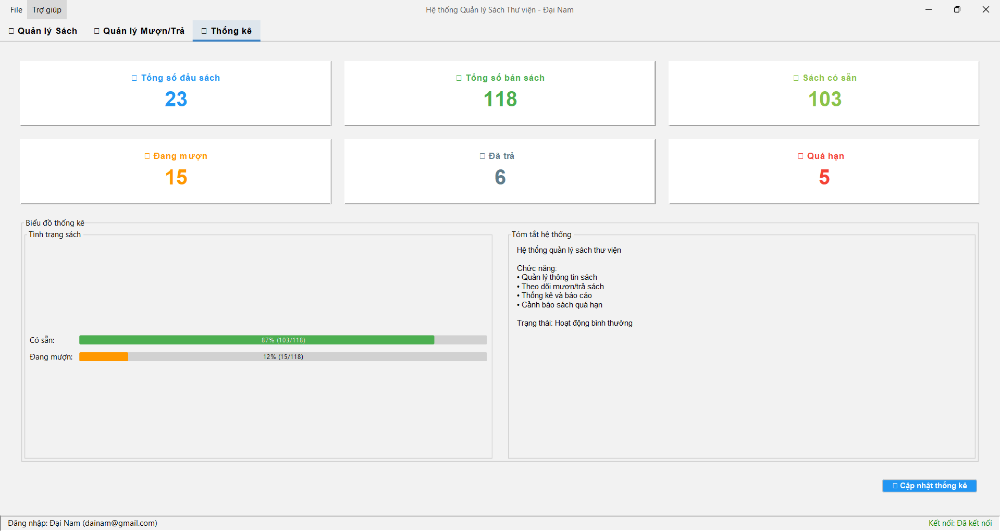
  <p><em>Dashboard thống kê với các chỉ số quan trọng và biểu đồ trực quan</em></p>
</div>

---

### 🗄️ Dữ liệu trong MongoDB

#### **Collection Books - Thông tin sách**
<div align="center">
  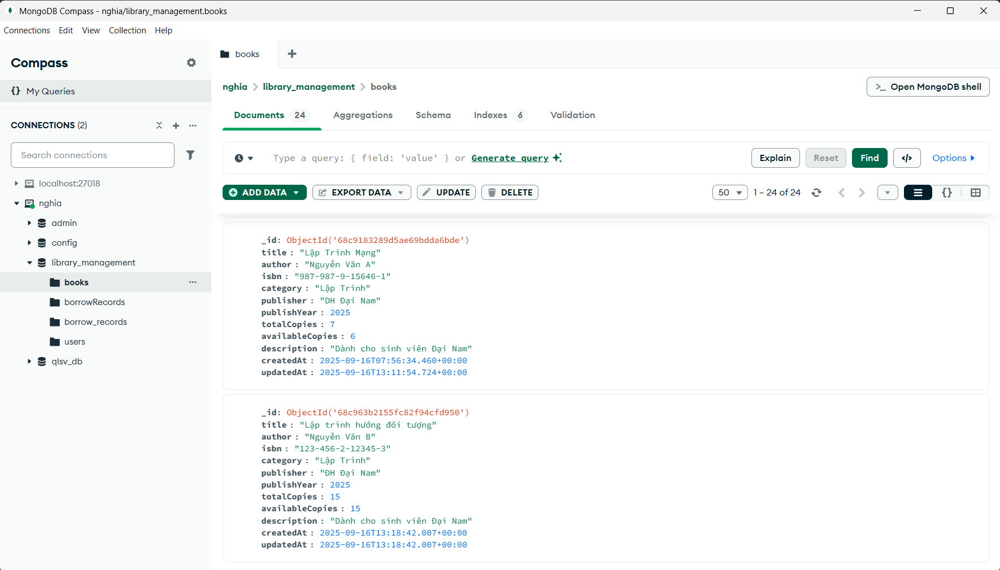
  <p><em>Collection books với 25+ cuốn sách đa dạng thể loại và thông tin đầy đủ</em></p>
</div>

#### **Collection Borrow Records - Lịch sử mượn/trả**
<div align="center">
  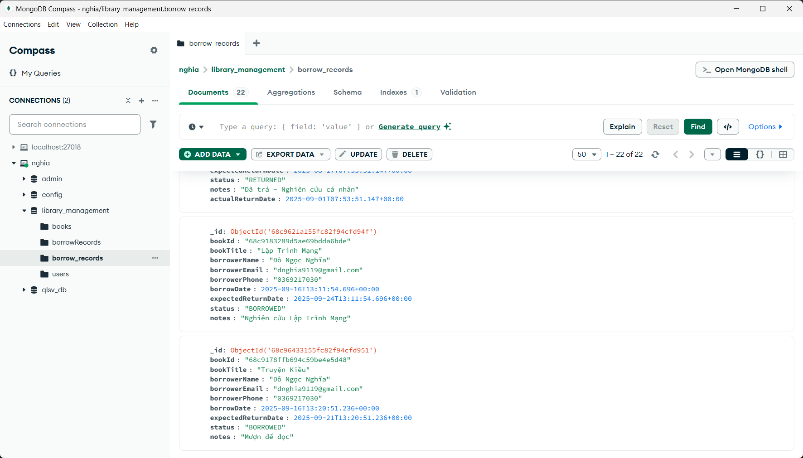
  <p><em>Collection borrow_records lưu trữ 20+ giao dịch với các trạng thái khác nhau</em></p>
</div>

#### **Collection Users - Tài khoản người dùng**
<div align="center">
  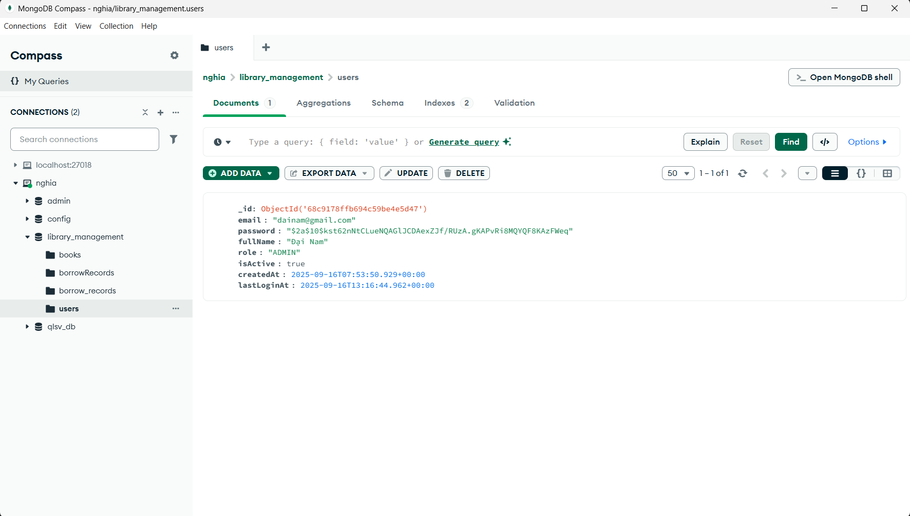
  <p><em>Collection users chứa thông tin tài khoản với mã hóa mật khẩu BCrypt</em></p>
</div>

---

## 4. ⚙️ Cài đặt và Chạy

### 📋 Yêu cầu hệ thống
- **Java 17** trở lên (OpenJDK hoặc Oracle JDK)
- **MongoDB** cài đặt & chạy trên `localhost:27017`
- **Windows** (khuyến nghị, đã kiểm thử)
- **Maven** để build project

### 🚀 Hướng dẫn cài đặt & chạy

**Bước 1:** Clone hoặc giải nén source code  
**Bước 2:** Cài đặt thư viện/phụ thuộc:
```powershell
cd d:\QLSTV
mvn clean install
mvn dependency:copy-dependencies -DoutputDirectory=target/lib
```

**Bước 3:** Khởi động MongoDB (nếu chưa chạy)

**Bước 4:** Sinh dữ liệu mẫu (nếu cần)
```powershell
java -cp "target/classes;target/lib/*" com.library.database.SampleDataGenerator force
```

**Bước 5:** Chạy server:
```powershell
java -cp "target/classes;target/lib/*" com.library.server.LibraryServer
```

**Bước 6:** Chạy client (có thể mở nhiều cửa sổ):
```powershell
java -cp "target/classes;target/lib/*" com.library.gui.LoginForm
```

**Tài khoản đăng nhập mặc định:**  
- Email: `dainam@gmail.com`  
- Mật khẩu: `dainam`

---

## 5. 👨‍💻 Thông tin Phát triển

| Trường thông tin         | Nội dung                                 |
|-------------------------|-------------------------------------------|
| **🏛️ Trường**           | Đại học Đại Nam (DaiNam University)      |
| **💻 Khoa**              | Công nghệ Thông tin                      |
| **📚 Môn học**           | Lập trình Mạng                           |
| **👤 Sinh viên**         | Đỗ Ngọc Nghĩa                            |
| **📧 Email**             | dnghia9119@gmail.com                     |
| **🌐 Website cá nhân**     | [dnnghia.vercel.app](https://dnnghia.vercel.app/)             |
| **Lớp**                 | CNTT 16-03                               |
| **Năm học**             | 2024-2025                                |

---

<div align="center">
    <p><strong>© 2025 DaiNam University - Faculty of Information Technology</strong></p>
    <p>All rights reserved.</p>
</div>
