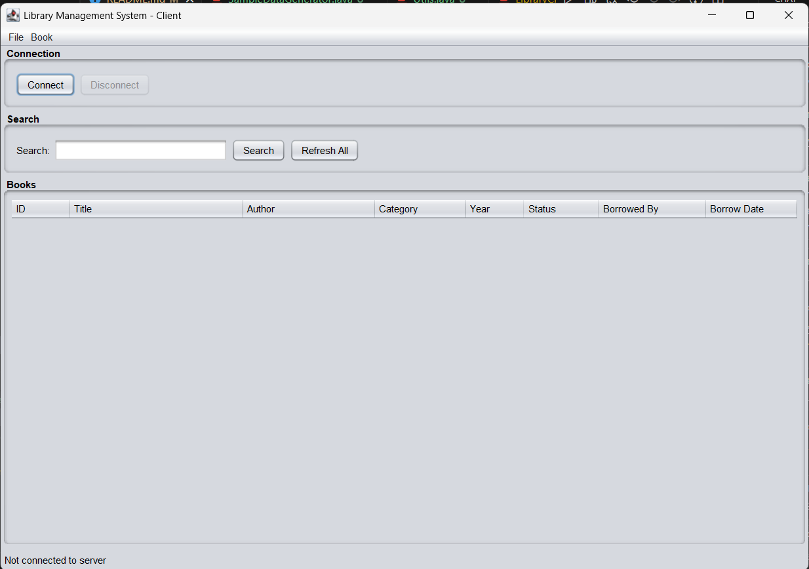
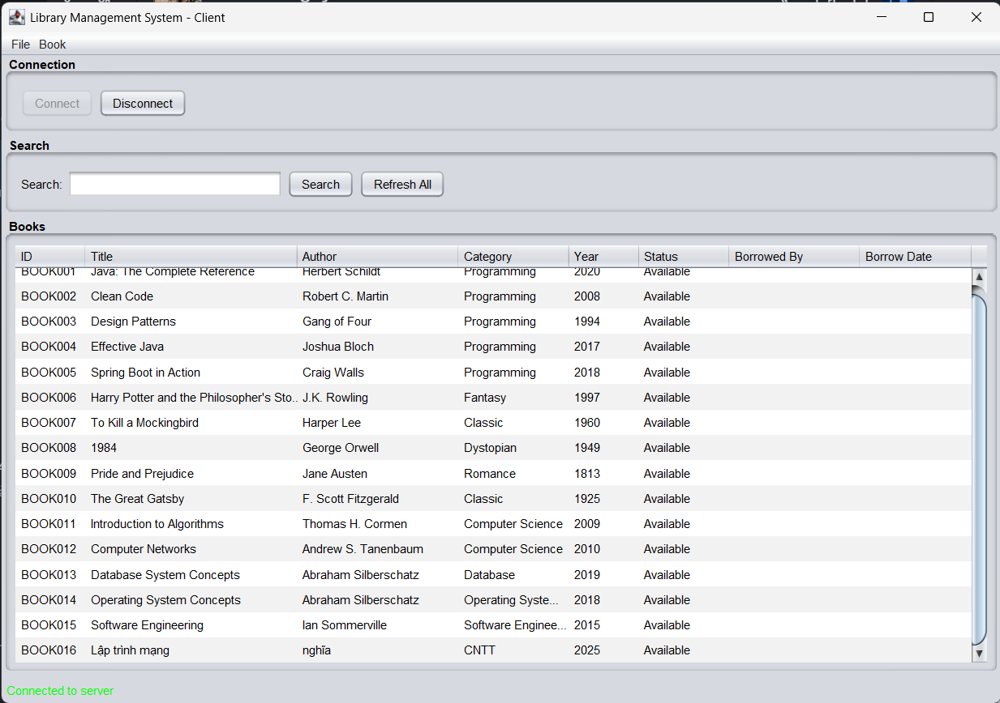
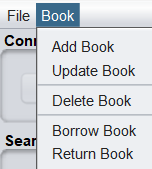
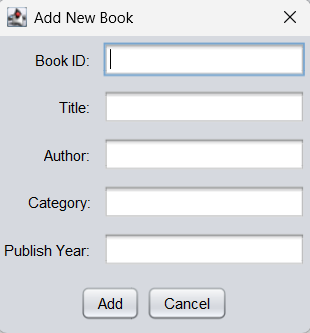
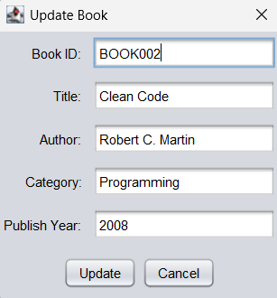
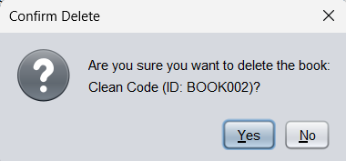
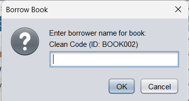

<h2 align="center">
    <a href="https://dainam.edu.vn/vi/khoa-cong-nghe-thong-tin">
    🎓 Faculty of Information Technology (DaiNam University)
    </a>
</h2>
<h2 align="center">
   HỆ THỐNG QUẢN LÝ SÁCH - THƯ VIỆN QUA MẠNG
</h2>

<div align="center">
    <p align="center">
        
        
        
    </p>

[](https://www.facebook.com/DNUAIoTLab)
[](https://dainam.edu.vn/vi/khoa-cong-nghe-thong-tin)
[](https://dainam.edu.vn)

[](https://www.oracle.com/java/)
[](https://docs.oracle.com/javase/tutorial/networking/sockets/)
[](https://docs.oracle.com/javase/tutorial/uiswing/)

</div>

---

## 📖 Giới thiệu Đề tài

**Hệ thống Quản lý Sách - Thư viện qua Mạng** là một ứng dụng được phát triển trong khuôn khổ môn học **Lập trình Mạng** tại Khoa Công nghệ Thông tin – Đại học Đại Nam.

Mục tiêu của hệ thống là xây dựng một **ứng dụng quản lý thư viện phân tán** cho phép nhiều người dùng truy cập và thao tác dữ liệu sách theo thời gian thực thông qua **TCP Socket Client-Server**. Ứng dụng hỗ trợ các nghiệp vụ cơ bản của một thư viện hiện đại: thêm sách, sửa, xóa, tìm kiếm, mượn – trả sách, đồng bộ dữ liệu giữa các client.

### 🎯 Mục tiêu và Chức năng chính

* ⚡ **TCP Socket Programming**: Giao tiếp Client-Server qua socket, hỗ trợ >50 client đồng thời
* 🖥️ **Java Swing GUI**: Giao diện trực quan, đồng bộ dữ liệu real-time
* 🔐 **Thread-safe Operations**: Điều phối truy cập đồng thời với ReadWriteLock
* 📚 **Library Management**: CRUD đầy đủ + tìm kiếm + mượn/trả sách
* 💾 **JSON Storage**: Dữ liệu lưu trữ và quản lý qua file JSON

---

## 🏗️ Kiến trúc Hệ thống

```ascii
┌─────────────────────────────────────────────────────────────────────────────────┐
│                           LIBRARY MANAGEMENT SYSTEM                            │
└─────────────────────────────────────────────────────────────────────────────────┘

    📱 CLIENT SIDE                    🌐 NETWORK                    🖥️ SERVER SIDE
┌─────────────────────┐                                    ┌─────────────────────┐
│  LibraryClientGUI   │◄───────── TCP Socket (12345) ─────►│   LibraryServer     │
│   (Java Swing)      │                                    │  (Multi-threaded)   │
├─────────────────────┤                                    ├─────────────────────┤
│   NetworkService    │        Request/Response Model       │   ClientHandler     │
└─────────────────────┘                                    └─────────────────────┘
                                                                        │
                                                           📄 DATA PERSISTENCE
                                                           ┌─────────────────────┐
                                                           │   SimpleBookDAO     │
                                                           │  (Thread-safe)      │
                                                           │        │            │
                                                           │   books.json        │
                                                           └─────────────────────┘
```

🔄 **Quy trình hoạt động**:

1. Client GUI → NetworkService → TCP Socket → Server
2. Server → ClientHandler → SimpleBookDAO → JSON File
3. JSON File → SimpleBookDAO → ClientHandler → TCP Socket → Client
4. Client nhận phản hồi và cập nhật GUI real-time

---

## 🛠️ Công nghệ sử dụng

### 🔧 Core Technologies

| Technology          | Purpose                       |
| ------------------- | ----------------------------- |
| **Java 8+**         | Ngôn ngữ lập trình chính      |
| **TCP Socket**      | Giao tiếp Client-Server       |
| **Java Swing**      | Xây dựng giao diện người dùng |
| **JSON**            | Lưu trữ dữ liệu sách          |
| **Multi-threading** | Xử lý đồng thời nhiều client  |

### 📚 Libraries & Frameworks

* **java.net.Socket**: TCP Socket
* **javax.swing**: GUI components
* **java.io**: File I/O
* **java.util.concurrent**: Quản lý thread
* **Custom JSON Parser**: Parser tự cài đặt

### 🏗️ Architecture Patterns

* **Client-Server**: Ứng dụng phân tán
* **DAO Pattern**: Tách biệt truy cập dữ liệu
* **Observer Pattern**: Cập nhật GUI real-time
* **Thread Pool**: Quản lý kết nối đồng thời

---

## 📁 Cấu trúc Project

```
📦 LTM_QuanLySachThuVienQuaMang/
├── src/                    # Source Code
│   ├── models/             # Book, Request, Response entities
│   ├── server/             # LibraryServer + ClientHandler  
│   ├── client/ui/          # LibraryClientGUI (Swing)
│   └── utils/              # SimpleBookDAO, SampleDataGenerator
├── docs/projects/anhduan/  # Screenshots & Documentation
├── books.json              # JSON Database (16 sample books)

```

---

## ⚙️ Cài đặt & Chạy

### 📋 Yêu cầu

* ✅ **Java 8+** (đã kiểm thử với OpenJDK 21)
* ✅ **Windows OS** với PowerShell
* ✅ **Port 12345** trống

### ▶️ Thực thi

```bash
# Server Console:
Database already contains 16 books.
Library Server started on port 12345
Waiting for clients...
New client connected: /127.0.0.1

# Client:
GUI window automatically opens and connects
```

---

## 📸 Hình ảnh Demo

### 🌐 Kết nối Server-Client

* 🚫 Chưa kết nối:

  

* ✅ Đã kết nối:

  

### 📚 Giao diện và Chức năng

* 🏠 Giao diện chính:

  

* ➕ Thêm sách mới:

  

* ✏️ Cập nhật sách:

  

* 🗑️ Xóa sách:

  

* 📖 Mượn sách:

  

---

## 🔧 API & Operations

### 📡 TCP Protocol

```java
Request: {RequestType, Object data}  →  Server  →  Response: {Status, Message, Object data}
```

### 🔄 Supported Operations

| Operation       | Description        | GUI Action              |
| --------------- | ------------------ | ----------------------- |
| `GET_ALL_BOOKS` | Load tất cả sách   | Startup, Refresh        |
| `ADD_BOOK`      | Thêm sách mới      | Add Button → Dialog     |
| `UPDATE_BOOK`   | Cập nhật thông tin | Update Button → Dialog  |
| `DELETE_BOOK`   | Xóa sách           | Delete Button → Confirm |
| `SEARCH_BOOKS`  | Tìm kiếm           | Search Field            |
| `BORROW_BOOK`   | Mượn sách          | Borrow Button           |
| `RETURN_BOOK`   | Trả sách           | Return Button           |

### 💾 Dữ liệu

* File: `books.json`
* Định dạng: JSON array (16 sample books)
* Thread-safe: ReadWriteLock
* Auto-backup sau mỗi thay đổi

---

## 👨‍💻 Thông tin Phát triển

| Field               | Value                                |
| ------------------- | ------------------------------------ |
| **🏛️ University**  | Đại học Đại Nam (DaiNam University)  |
| **💻 Faculty**      | Khoa Công nghệ Thông tin             |
| **🌐 Course**       | Lập trình Mạng (Network Programming) |
| **☕ Language**      | Java                                 |
| **🔗 Architecture** | TCP Client-Server                    |
| **📅 Semester**     | 2024-2025                            |

### 📬 Liên hệ

* 👤 **Họ tên:** Đỗ Ngọc Nghĩa
* 🎓 **Lớp:** CNTT 16-03
* 📧 **Email:** [dnghia9119@gmail.com](mailto:dnghia9119@gmail.com)

<div align="center">
    <p>© 2025 DaiNam University - Faculty of Information Technology</p>
    <p>All rights reserved.</p>
</div>
